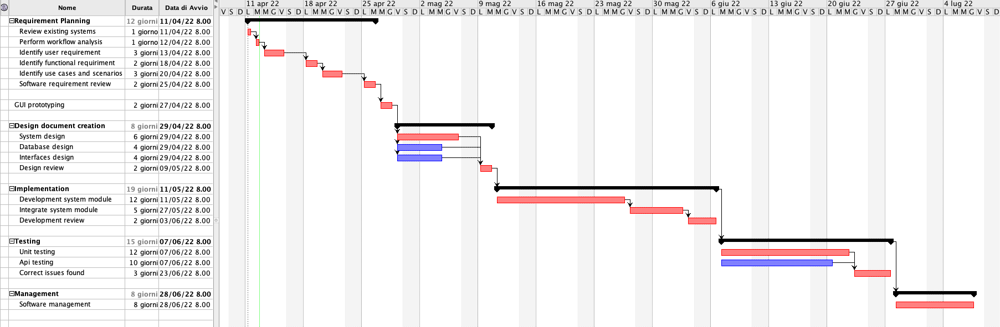

# Project Estimation  
Date: 11 April 2022

Version: 1.0

# Estimation approach
Consider the EZWH  project as described in YOUR requirement document, assume that you are going to develop the project INDEPENDENT of the deadlines of the course
# Estimate by size
### 
|             | Estimate                        |             
| ----------- | ------------------------------- |  
| NC =  Estimated number of classes to be developed   |   18             |             
|  A = Estimated average size per class, in LOC       |  600                          | 
| S = Estimated size of project, in LOC (= NC * A) | 10800 |
| E = Estimated effort, in person hours (here use productivity 10 LOC per person hour)  |  1080   person hours            |   
| C = Estimated cost, in euro (here use 1 person hour cost = 30 euro) | 32400 euros | 
| Estimated calendar time, in calendar weeks (Assume team of 4 people, 8 hours per day, 5 days per week ) |    1080/(8*4*5)=  7 weeks             |   

# Estimate by product decomposition
### 
|         component name    | Estimated effort (person hours)   |             
| ----------- | ------------------------------- | 
|requirement document    | 160|
| GUI prototype |60|
|design document | 150 |
|code |200|
| unit tests |120|
| api tests |80|
| management documents  |70|

# Estimate by activity decomposition

# Summary

Report here the results of the three estimation approaches. The  estimates may differ. Discuss here the possible reasons for the difference

|             | Estimated effort                        |   Estimated duration |          
| ----------- | ------------------------------- | ---------------|
| estimate by size | 1080 person hours |7 weeks|
| estimate by product decomposition | 840 person hours| 5,5 weeks|
| estimate by activity decomposition |1920 person hours|12 weeks|

