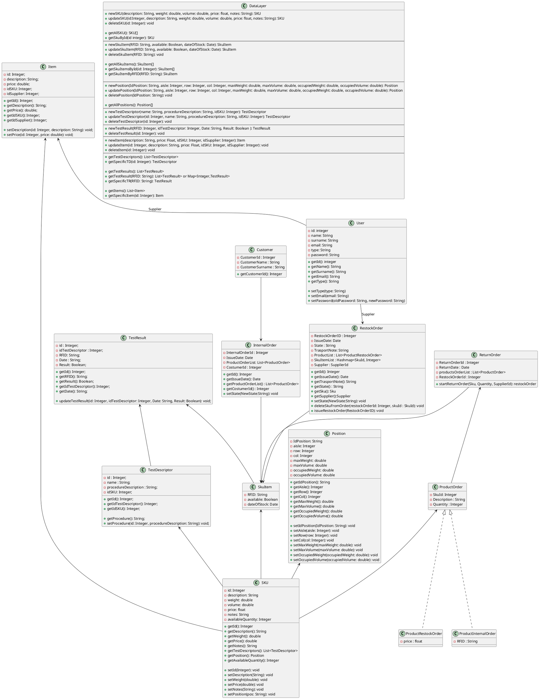

# UML example

```plantuml
@startuml
class SKU {
    -id: Integer
    -description: String
    -weight: double
    -volume: double
    -price: float
    -notes: String
    -availableQuantity: Integer 

    +getId(): Integer
    +getDescription(): String
    +getWeight(): double
    +getPrice(): double
    +getNotes(): String
    +getTestDescriptors(): List<TestDescriptor>
    +getPosition(): Position
    +getAvailableQuantity(): Integer

    +setId(Integer): void
    +setDescription(String): void
    +setWeight(double): void
    +setPrice(double): void
    +setNotes(String): void
    +setPosition(pos: String): void
}

class SkuItem {
    -RFID: String
    -available: Boolean
    -dateOfStock: Date
}

class Position {
    -IdPosition: String
    -aisle: Integer
    -row: Integer
    -col: Integer
    -maxWeight: double
    -maxVolume: double
    -occupiedWeight: double
    -occupiedVolume: double

    +getIdPosition(): String
    +getAisle(): Integer
    +getRow(): Integer
    +getCol(): Integer
    +getMaxWeight(): double
    +getMaxVolume(): double
    +getOccupiedWeight(): double
    +getOccupiedVolume(): double

    +setIdPosition(IdPosition: String): void
    +setAisle(aisle: Integer): void
    +setRow(row: Integer): void
    +setCol(col: Integer): void
    +setMaxWeight(maxWeight: double): void
    +setMaxVolume(maxVolume: double): void
    +setOccupiedWeight(occupiedWeight: double): void
    +setOccupiedVolume(occupiedVolume: double): void
}

class User
{
    -id: integer
    -name: String
    -surname: String
    -email: String
    -type: String
    -password: String
  
    +getId(): integer
    +getName(): String
    +getSurname(): String
    +getEmail(): String
    +getType(): String

    +setType(type: String)
    +setEmail(email: String)
    +setPassword(oldPassword: String, newPassword: String)
}

class TestDescriptor{
    -id : Integer;
    -name : String;
    -procedureDescription : String;
    -idSKU: Integer;

    +getId(): Integer;
    +getIdTestDescriptor(): Integer;
    +getIdSKU(): Integer;

    +getProcedure(): String;
    +setProcedure(id: Integer, procedureDescription: String): void;
}

class TestResult{
    -id : Integer;
    -idTestDescriptor : Integer;
    -RFID: String;
    -Date : String; 
    -Result: Boolean;

    +getId(): Integer;
    +getRFID(): String;
    +getResult(): Boolean;
    +getIdTestDescriptor(): Integer;
    +getDate(): String;

    +updateTestResult(id: Integer, idTestDescriptor: Integer, Date: String, Result: Boolean): void;
}
class Item {
    -id: Integer;
    -description: String;
    -price: double;
    -idSKU: Integer;
    -idSupplier: Integer;

    +getId(): Integer;
    +getDescription(): String;
    +getPrice(): double;
    +getIdSKU(): Integer;
    +getIdSupplier(): Integer;

    +setDescription(id: Integer, description: String): void;
    +setPrice(id: Integer, price: double): void;
}

class RestockOrder{
    -RestockOrderID : Integer
    -IssueDate: Date
    -State : String
    -TrasportNote: String
    -ProductList : List<ProductRestockOrder>
    -SkuItemList : Hashmap<SkuId, Integer> 
    -Supplier : SupplierId

    +getId(): Integer
    +getIssueDate(): Date
    +getTrasportNote(): String
    +getState() : String
    +getSku(): Sku
    +getSupplier():Supplier
    +setState(NewState:String): void
    +deleteSkuFromOrder(restockOrderId: Integer, skuId : SkuId): void 
    +issueRestockOrder(RestockOrderID): void
}

class ProductRestockOrder{
    -price : float
}
class ProductInternalOrder{
    -RFID : String
}

class ProductOrder{
    -SkuId: Integer
    -Description : String
    -Quantity : Integer
}

class ReturnOrder{
    -ReturnOrderId : Integer
    -ReturnDate : Date
    -productsOrderList : List<ProductOrder>
    -RestockOrderId : Integer

    +startReturnOrder(Sku, Quantity, SupplierId): restockOrder
}
class Customer{
    -CustomerId : Integer
    -CustomerName : String
    -CustomerSurname : String

    +getCustomerId(): Integer
}

class InternalOrder{
    -InternalOrderId : Integer
    -IssueDate: Date
    -ProductOrderList: List<ProductOrder>
    -CostumerId : Integer

    +getId(): Integer
    +getIssueDate(): Date
    +getProductOrderList() : List<ProductOrder>
    +getCostumerId() : Integer
    +setState(NewState:String): void
}


class DataLayer{
    +newSKU(description: String, weight: double, volume: double, price: float, notes: String): SKU
    +updateSKU(id:Integer, description: String, weight: double, volume: double, price: float, notes: String): SKU
    +deleteSKU(id: Integer): void

    +getAllSKU(): SKU[]
    +getSkuById(id integer): SKU
    --
    +newSkuItem(RFID: String, available: Boolean, dateOfStock: Date): SkuItem
    +updateSkuItem(RFID: String, available: Boolean, dateOfStock: Date): SkuItem
    +deleteSkuItem(RFID: String): void

    +getAllSkuItems(): SkuItem[]
    +getSkuItemsById(id: Integer): SkuItem[]
    +getSkuItemByRFID(RFID: String): SkuItem

    --
    +newPosition(IdPosition: String, aisle: Integer, row: Integer, col: Integer, maxWeight: double, maxVolume: double, occupiedWeight: double, occupiedVolume: double): Position
    +updatePosition(IdPosition: String, aisle: Integer, row: Integer, col: Integer, maxWeight: double, maxVolume: double, occupiedWeight: double, occupiedVolume: double): Position
    +deletePosition(IdPosition: String): void

    +getAllPositions(): Position[]
    --
    +newTestDescriptor(name: String, procedureDescription: String, idSKU: Integer): TestDescriptor
    +updateTestDescriptor(id: Integer, name: String, procedureDescription: String, idSKU: Integer): TestDescriptor
    +deleteTestDescriptor(id: Integer): void
    --
    +newTestResult(RFID: Integer, idTestDescriptor: Integer, Date: String, Result: Boolean ): TestResult
    +deleteTestResult(id: Integer): void
    --
    +newItem(description: String, price: Float, idSKU: Integer, idSupplier: Integer): Item
    +updateItem(id: Integer, description: String, price: Float, idSKU: Integer, idSupplier: Integer): void
    +deleteItem(id: Integer): void
    --
    +getTestDescriptors(): List<TestDescriptor>
    +getSpecificTD(id: Integer): TestDescriptor

    +getTestResults(): List<TestResult>
    +getTestResult(RFID: String): List<TestResult> or Map<Integer,TestResult>
    +getSpecificTR(RFID: String): TestResult

    +getItems(): List<Item>
    +getSpecificItem(id: Integer): Item
}


TestResult <-- TestDescriptor
TestDescriptor <-- SKU
SkuItem <-- SKU
TestResult <-- SkuItem
Item <-- SKU
Position <-- SKU
ProductOrder <-- SKU
Item <-- User :Supplier

ReturnOrder <-- ProductOrder
ReturnOrder --> SkuItem
InternalOrder --> SkuItem

User --> RestockOrder :Supplier
RestockOrder --> SkuItem
Customer --> InternalOrder

ProductOrder <|.. ProductInternalOrder
ProductOrder <|.. ProductRestockOrder
@enduml
```