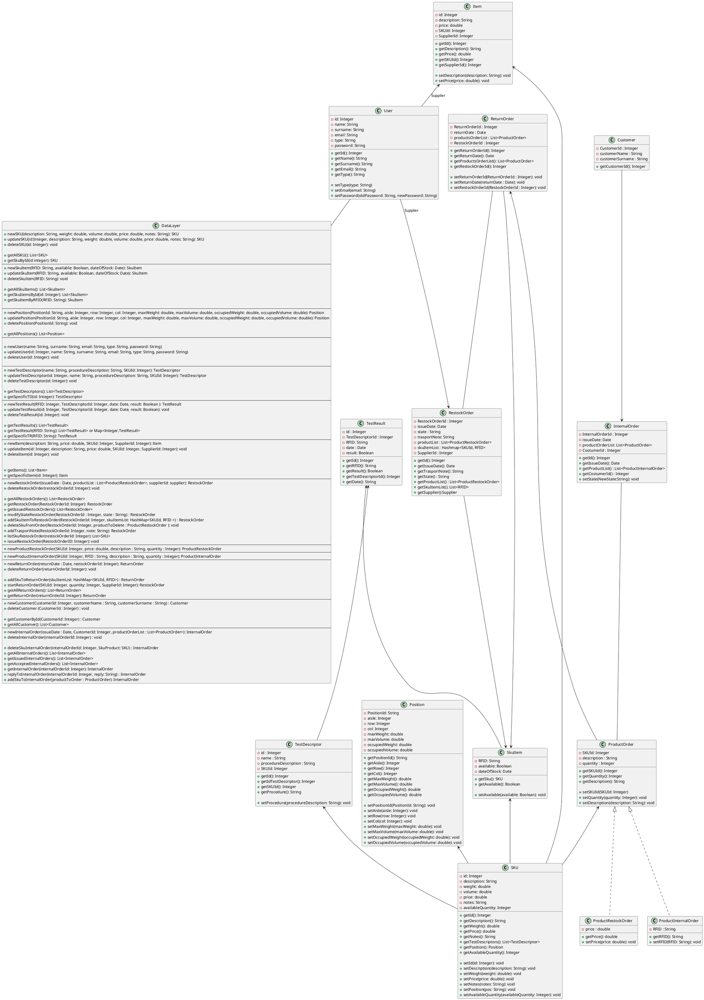

# UML example

```plantuml
@startuml

class SKU {
    -id: Integer
    -description: String
    -weight: double
    -volume: double
    -price: double
    -notes: String
    -availableQuantity: Integer 

    +getId(): Integer
    +getDescription(): String
    +getWeight(): double
    +getPrice(): double
    +getNotes(): String
    +getTestDescriptors(): List<TestDescriptor>
    +getPosition(): Position
    +getAvailableQuantity(): Integer

    +setId(id: Integer): void
    +setDescription(description: String): void
    +setWeight(weight: double): void
    +setPrice(price: double): void
    +setNotes(notes: String): void
    +setPosition(pos: String): void
    +setAvailableQuantity(availableQuantity: Integer): void
}

class SkuItem {
    -RFID: String
    -available: Boolean
    -dateOfStock: Date

    +getSku(): SKU
    +getAvailable(): Boolean

    +setAvailable(available: Boolean): void
}

class Position {
    -PositionId: String
    -aisle: Integer
    -row: Integer
    -col: Integer
    -maxWeight: double
    -maxVolume: double
    -occupiedWeight: double
    -occupiedVolume: double

    +getPositionId(): String
    +getAisle(): Integer
    +getRow(): Integer
    +getCol(): Integer
    +getMaxWeight(): double
    +getMaxVolume(): double
    +getOccupiedWeight(): double
    +getOccupiedVolume(): double

    +setPositionId(PositionId: String): void
    +setAisle(aisle: Integer): void
    +setRow(row: Integer): void
    +setCol(col: Integer): void
    +setMaxWeight(maxWeight: double): void
    +setMaxVolume(maxVolume: double): void
    +setOccupiedWeight(occupiedWeight: double): void
    +setOccupiedVolume(occupiedVolume: double): void
}

class User
{
    -id: Integer
    -name: String
    -surname: String
    -email: String
    -type: String
    -password: String
  
    +getId(): Integer
    +getName(): String
    +getSurname(): String
    +getEmail(): String
    +getType(): String

    +setType(type: String)
    +setEmail(email: String)
    +setPassword(oldPassword: String, newPassword: String)
}

class TestDescriptor{
    -id : Integer
    -name : String
    -procedureDescription : String
    -SKUId: Integer

    +getId(): Integer
    +getIdTestDescriptor(): Integer
    +getSKUId(): Integer
    +getProcedure(): String
    
    +setProcedure(procedureDescription: String): void
}

class TestResult{
    -id : Integer
    -TestDescriptorId : Integer
    -RFID: String
    -date : Date
    -result: Boolean

    +getId(): Integer
    +getRFID(): String
    +getResult(): Boolean
    +getTestDescriptorId(): Integer
    +getDate(): String
}
class Item {
    -id: Integer
    -description: String
    -price: double
    -SKUId: Integer
    -SupplierId: Integer

    +getId(): Integer
    +getDescription(): String
    +getPrice(): double
    +getSKUId(): Integer
    +getSupplierId(): Integer

    +setDescription(description: String): void
    +setPrice(price: double): void
}

class RestockOrder{
    -RestockOrderId : Integer
    -issueDate: Date
    -state : String
    -trasportNote: String
    -productList : List<ProductRestockOrder>
    -skuItemList : Hashmap<SKUId, RFID> 
    -SupplierId : Integer

    +getId(): Integer
    +getIssueDate(): Date
    +getTrasportNote(): String
    +getState() : String
    +getProductList() : List<ProductRestockOrder>
    +getSkuItemList(): List<RFID>
    +getSupplier():Supplier

}

class ProductRestockOrder{
    -price : double

    +getPrice(): double
    +setPrice(price: double): void
}
class ProductInternalOrder{
    -RFID : String

    +getRFID(): String
    +setRFID(RFID: String): void
}

class ProductOrder{
    -SKUId: Integer
    -description : String
    -quantity : Integer

    +getSKUId(): Integer
    +getQuantity(): Integer
    +getDescription(): String

    +setSKUId(SKUId: Integer)
    +setQuantity(quantity: Integer): void
    +setDescription(description: String): void
}

class ReturnOrder{
    -ReturnOrderId : Integer
    -returnDate : Date
    -productsOrderList : List<ProductOrder>
    -RestockOrderId : Integer
    
    +getReturnOrderId(): Integer
    +getReturnDate(): Date
    +getProductsOrderList(): List<ProductOrder>
    +getRestockOrderId(): Integer

    +setReturnOrderId(ReturnOrderId : Integer): void
    +setReturnDate(returnDate : Date): void
    +setRestockOrderId(RestockOrderId : Integer): void
}

class InternalOrder{
    -InternalOrderId : Integer
    -issueDate: Date
    -productOrderList: List<ProductOrder>
    -CostumerId : Integer

    +getId(): Integer
    +getIssueDate(): Date
    +getProductList() : List<ProductInternalOrder>
    +getCostumerId() : Integer
    +setState(NewState:String): void
}

class Customer{
    -CustomerId : Integer
    -customerName : String
    -customerSurname : String

    +getCustomerId(): Integer

}

class DataLayer{
    +newSKU(description: String, weight: double, volume: double, price: double, notes: String): SKU
    +updateSKU(id:Integer, description: String, weight: double, volume: double, price: double, notes: String): SKU
    +deleteSKU(id: Integer): void

    +getAllSKU(): List<SKU>
    +getSkuById(id integer): SKU
    --
    +newSkuItem(RFID: String, available: Boolean, dateOfStock: Date): SkuItem
    +updateSkuItem(RFID: String, available: Boolean, dateOfStock: Date): SkuItem
    +deleteSkuItem(RFID: String): void

    +getAllSkuItems(): List<SkuItem>
    +getSkuItemsById(id: Integer): List<SkuItem>
    +getSkuItemByRFID(RFID: String): SkuItem

    --
    +newPosition(PositionId: String, aisle: Integer, row: Integer, col: Integer, maxWeight: double, maxVolume: double, occupiedWeight: double, occupiedVolume: double): Position
    +updatePosition(PositionId: String, aisle: Integer, row: Integer, col: Integer, maxWeight: double, maxVolume: double, occupiedWeight: double, occupiedVolume: double): Position
    +deletePosition(PositionId: String): void

    +getAllPositions(): List<Position>
    --

    +newUser(name: String, surname: String, email: String, type: String, password: String)
    +updateUser(id: Integer, name: String, surname: String, email: String, type: String, password: String)
    +deleteUser(id: Integer): void

    --
    +newTestDescriptor(name: String, procedureDescription: String, SKUId: Integer): TestDescriptor
    +updateTestDescriptor(id: Integer, name: String, procedureDescription: String, SKUId: Integer): TestDescriptor
    +deleteTestDescriptor(id: Integer): void

    +getTestDescriptors(): List<TestDescriptor>
    +getSpecificTD(id: Integer): TestDescriptor
    --
    +newTestResult(RFID: Integer, TestDescriptorId: Integer, date: Date, result: Boolean ): TestResult
    +updateTestResult(id: Integer, TestDescriptorId: Integer, date: Date, result: Boolean): void
    +deleteTestResult(id: Integer): void

    +getTestResults(): List<TestResult>
    +getTestResult(RFID: String): List<TestResult> or Map<Integer,TestResult>
    +getSpecificTR(RFID: String): TestResult
    --
    +newItem(description: String, price: double, SKUId: Integer, SupplierId: Integer): Item
    +updateItem(id: Integer, description: String, price: double, SKUId: Integer, SupplierId: Integer): void
    +deleteItem(id: Integer): void

    
    +getItems(): List<Item>
    +getSpecificItem(id: Integer): Item
    --
    +newRestockOrder(issueDate : Date, productList : List<ProductRestockOrder>, supplierId: supplier): RestockOrder
    +deleteRestockOrder(restockOrderId: Integer): void 

    +getAllRestockOrders(): List<RestockOrder>
    +getRestockOrder(RestockOrderId: Integer): RestockOrder
    +getIssuedRestockOrders(): List<RestockOrder>
    +modifyStateRestockOrder(RestockOrderId : Integer, state : String) : RestockOrder
    +addSkuItemToRestockOrder(RestockOrderId: Integer, skuItemList: HashMap<SKUId, RFID >) : RestockOrder
    +deleteSkuFromOrder(RestockOrderId: Integer, productToDelete : ProductRestockOrder ): void
    +addTrasportNote(RestockOrderId: Integer, note: String): RestockOrder
    +listSkuRestockOrder(restockOrderId: Integer): List<SKU>
    +issueRestockOrder(RestockOrderID: Integer): void
    --
    +newProductRestockOrder(SKUId: Integer, price: double, description : String, quantity : Integer): ProductRestockOrder 
    --
    +newProductInternalOrder(SKUId: Integer, RFID : String, description : String, quantity : Integer): ProductInternalOrder 
    --
    +newReturnOrder(returnDate : Date, restockOrderId: Integer): ReturnOrder
    +deleteReturnOrder(returnOrderId: Integer): void 

    +addSkuToReturnOrder(skuItemList: HashMap<SKUId, RFID>) : ReturnOrder 
    +startReturnOrder(SKUId: Integer, quantity: Integer, SupplierId: Integer): RestockOrder
    +getAllReturnOrders(): List<ReturnOrder>
    +getReturnOrder(returnOrderId: Integer): ReturnOrder
    --
    +newCustomer(CustomerId: Integer, customerName : String, customerSurname : String) : Customer
    +deleteCustomer (CustomerId : Integer) : void

    +getCustomerById(CustomerId: Integer) : Customer
    +getAllCustomer(): List<Customer>
    --
    +newInternalOrder(issueDate : Date, CustomerId: Integer, productOrderList : List<ProductOrder>): InternalOrder
    +deleteInternalOrder(internalOrderId: Integer) : void

    +deleteSkuInternalOrder(internalOrderId: Integer, SkuProduct: SKU) : InternalOrder 
    +getAllInternalOrders(): List<InternalOrder>
    +getIssuedInternalOrders(): List<InternalOrder>
    +getAcceptedInternalOrders(): List<InternalOrder>
    +getInternalOrder(internalOrderId: Integer): InternalOrder
    +replyToInternalOrder(internalOrderId: Integer, reply: String) : InternalOrder 
    +addSkuToInternalOrder(productToOrder : ProductOrder): InternalOrder 
}

/' TODO '/

TestResult <-- TestDescriptor
TestDescriptor <-- SKU
SkuItem <-- SKU
TestResult <-- SkuItem
Item <-- SKU
Position <-- SKU
ProductOrder <-- SKU
Item <-- User :Supplier

ReturnOrder <-- ProductOrder
ReturnOrder --> SkuItem
ReturnOrder -- RestockOrder

InternalOrder -- ProductOrder

User --> RestockOrder :Supplier
RestockOrder --> SkuItem
Customer --> InternalOrder
User -- DataLayer


ProductOrder <|.. ProductInternalOrder
ProductOrder <|.. ProductRestockOrder

@enduml
```